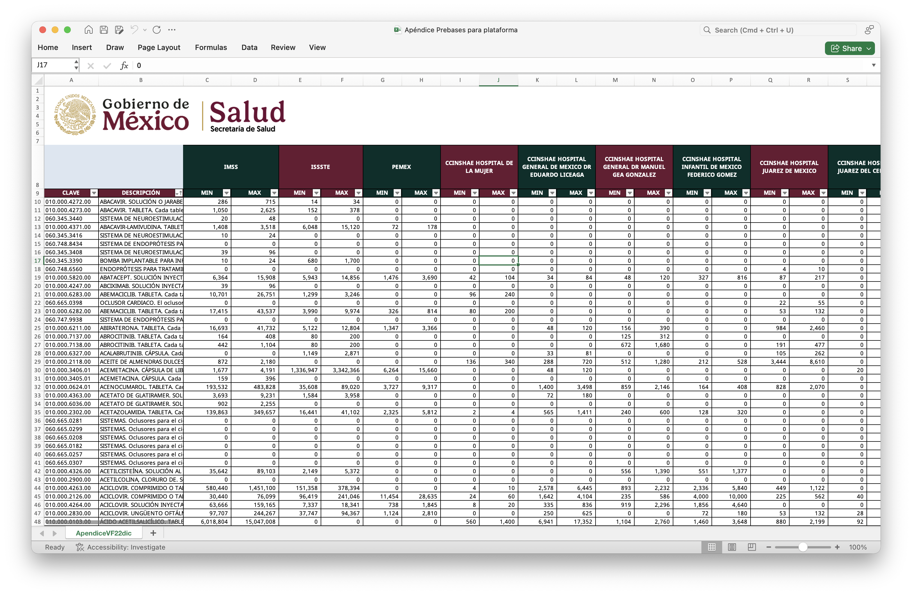
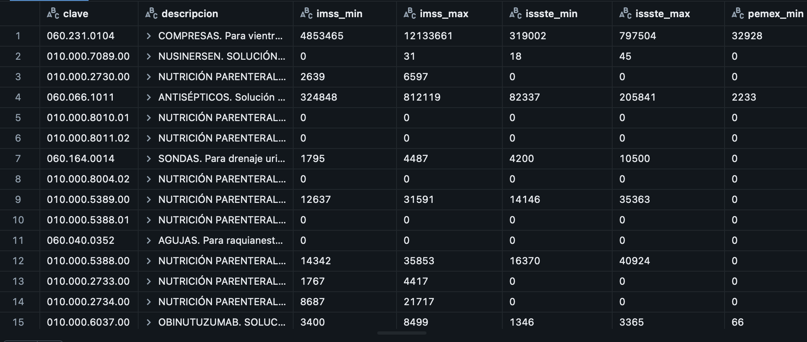

# Análisis del mercado público de medicamentos y bienes terapéuticos 2027-2028

> **Business Analyst/Data Analyst**  
> Transformación de datos públicos gubernamentales mediante arquitectura Medallion en Databricks

El gobierno de México hizo pública la información de qué medicamentos y bienes terapéuticos adquirirá durante el bienio 2027-2028. Este proyecto demuestra capacidades técnicas y analíticas para transformar datos complejos en insights accionables.

La información es pública y está disponible en esta liga: 

[https://discusion.salud.gob.mx/](https://discusion.salud.gob.mx/)

## Datos Crudos

### Estructura Original

El archivo fuente contiene las proyecciones de demanda bianual del sector salud público mexicano, estructurado de la siguiente manera:

**Columnas de identificación (2):**
- `Clave`: Identificador único del producto en el catálogo consolidado de compras del sector salud
- `Descripción`: Denominación completa del medicamento, material de curación o insumo médico

**Columnas de demanda institucional (124):**

Cada una de las **62 instituciones** del sector salud reporta su demanda proyectada mediante dos columnas:
- `[Institución]_min`: Piezas mínimas requeridas (escenario conservador)
- `[Institución]_max`: Piezas máximas requeridas (escenario optimista)

| Columna | Descripción | Tipo de Dato | Ejemplo |
|---------|-------------|--------------|---------|
| Clave | ID del producto en catálogo gobierno | Alfanumérico | `010.000.0626.01` |
| Descripción | Denominación exacta del insumo | Texto | `FITOMENADIONA. SOLUCIÓN O EMULSION INYECTABLE. Cada ampolleta contiene: Fitomenadiona 10 mg. Envase con 5 ampolletas de 1 mL.` |
| IMSS_min | Piezas mínimas bianuales - IMSS | Numérico | `52335` |
| IMSS_max | Piezas máximas bianuales - IMSS | Numérico | `130836` |
| ISSSTE_min | Piezas mínimas bianuales - ISSSTE | Numérico | `0` |
| ISSSTE_max | Piezas máximas bianuales - ISSSTE | Numérico | `0` |
| ... | ... | ... | ... |
| SPPS_CENAPRECE_min | Piezas mínimas - Servicios de Salud | Numérico | `5000` |
| SPPS_CENAPRECE_max | Piezas máximas - Servicios de Salud | Numérico | `7500` |

**Total: 126 columnas** (2 identificación + 124 demanda institucional)

### Instituciones Representadas

Las 62 instituciones se agrupan en 6 organismos rectores:

1. **IMSS** - Instituto Mexicano del Seguro Social
2. **ISSSTE** - Instituto de Seguridad y Servicios Sociales de los Trabajadores del Estado
3. **PEMEX** - Petróleos Mexicanos (servicios de salud)
4. **CCINSHAE** - Centros e Institutos Nacionales de Salud (Hospital de la Mujer, Hospital Infantil, etc.)
5. **IMSS Bienestar** - Entidades federativas adheridas por estado (Baja California, Sonora, Chiapas, etc.)
6. **SPPS** - Servicios Estatales de Salud y Programas Especiales (CENAPRECE, CENAVECE, etc.)



### Desafío de Análisis

La granularidad institucional (62 entidades) dificulta:
- Análisis comparativo de demanda agregada
- Identificación de patrones de compra por organismo rector
- Evaluación de riesgo financiero por contribución de cada institución. 
- Visualización de distribución de mercado

## Estrategia

Pese a tener 62 instituciones desglosadas, 59 de ella derivan de 3 organismos agrupables, por lo que podemos resumir la información a 6 instituciones rectoras:

- IMSS
- ISSSTE
- PEMEX
- CCINSHAE
- IMSS BIENESTAR
- SPPS_CENAPRECE

## Metodología 

Este proyecto implementa una arquitectura **Medallion** (Bronze-Silver) sobre Databricks utilizando **PySpark**, diseñada para transformar datos crudos no estructurados en información analítica accionable.

### Arquitectura de Datos

#### 🥉 Bronze Layer (Capa de Ingesta)
**Objetivo técnico**: Preservar la estructura original del Excel sin pérdida de información.

**Proceso**:
1. **Ingesta**: Lectura del archivo Excel con 128 columnas usando `pandas` + `openpyxl`
2. **Preservación de orden**: Agregación de columna `_row_id` antes de la conversión a Spark
3. **Limpieza básica**: Filtrado de filas completamente vacías sin alterar estructura
4. **Persistencia**: Almacenamiento en Delta Lake como `bronze_licitacion_info`

**Resultado**: 128 columnas preservando la granularidad institucional (62 instituciones × 2 métricas + metadata)


#### 🥈 Silver Layer (Capa Analítica)
**Objetivo de negocio**: Consolidar información por organismo rector para facilitar análisis estratégico.

**Proceso de transformación**:
1. **Detección inteligente de headers**: Identificación automática de filas de encabezado mediante búsqueda de palabra clave "clave"
2. **Normalización de nombres**: Aplicación de función `norm()` para estandarizar nombres de columnas (eliminar acentos, caracteres especiales, unificar formato)
3. **Agregación por prefijo institucional**: 
   - **Patrón**: `{organismo}_{institucion}_min/max` → `{organismo}_min/max`
   - **Familias agregadas**:
     - `imss_bienestar_*` → 32 instituciones estatales consolidadas
     - `ccinshae_*` → Hospitales de especialidad consolidados  
     - `salud_spps_*` → Servicios estatales de salud consolidados
4. **Conversión a numérico**: Transformación segura de strings a `double` con manejo de nulos y separadores de miles
5. **Persistencia**: Almacenamiento en Delta Lake como `silver_licitacion_info`

**Resultado**: 14 columnas estructuradas:
- `clave`, `descripcion` (identificadores)
- 6 organismos × 2 métricas (min/max): `imss`, `issste`, `pemex`, `imss_bienestar`, `ccinshae`, `salud_spps`
- `totales_min`, `totales_max` (validación)



### Validación y Calidad de Datos

**Validación de integridad**: Query SQL que compara la suma de organismos individuales vs. totales declarados:
```sql
sum(imss + issste + pemex + imss_bienestar + ccinshae + salud_spps) = totales
```
Esta validación asegura que la agregación no introdujo pérdida ni duplicación de información.

### Valor de Negocio

**Enfoque estratégico**: 
- **Reducción de complejidad operativa**: Consolidación de 128 dimensiones institucionales a 6 organismos rectores del sector salud, preservando la inteligencia estratégica necesaria para la toma de decisiones.

- **Gestión de riesgo de cartera**: La agregación por institución rectora permite:
  - **Evaluación de exposición financiera**: Identificar la distribución de volumen de compra entre organismos con diferentes ciclos de pago (1-8 meses)
  - **Optimización de flujo de caja**: Priorizar productos con mayor ponderación en instituciones de pago ágil (IMSS, ISSSTE)
  - **Mitigación de riesgo de liquidez**: Diversificar cartera considerando la solidez financiera y capacidad de pago institucional

- **Inteligencia de mercado sectorial**: Facilita análisis estratégicos como:
  - Identificación de instituciones ancla por producto/categoría terapéutica
  - Mapeo de concentración de demanda para negociación de volumen
  - Detección de oportunidades de mercado basadas en patrones de adquisición institucional
  - Análisis de variabilidad de demanda (rangos min-max) como indicador de certidumbre presupuestal

**Impacto operativo**: Permite a equipos comerciales y financieros tomar decisiones informadas sobre asignación de recursos, estrategias de cobro y gestión de capital de trabajo, alineadas con el perfil de riesgo-retorno de cada organismo rector.

**Enfoque técnico**:
- **Escalabilidad**: PySpark permite procesar volúmenes mayores si el catálogo crece
- **Reproducibilidad**: Pipeline automatizado desde Excel crudo hasta tabla analítica
- **Trazabilidad**: Arquitectura medallion permite auditar transformaciones por capa


## Visualización 

[Visualización interactiva en Looker Studio](https://lookerstudio.google.com/reporting/c0f3b5c5-c208-4a5a-b81e-9f136d65251e)

Dashboard que permite explorar la demanda agregada por organismo, producto y rangos de cantidad.

---

## Stack Tecnológico

- **Plataforma**: Databricks (Free Edition)
- **Procesamiento**: Apache Spark (PySpark)
- **Formato de datos**: Delta Lake
- **Ingesta**: Pandas + OpenPyXL
- **Visualización**: Looker Studio, Tableau
- **Lenguajes**: Python, SQL

## Logros Clave

✅ **Reducción dimensional**: 128 → 14 columnas (-89% complejidad)  
✅ **Automatización**: Pipeline reproducible end-to-end  
✅ **Validación de calidad**: 100% integridad de datos verificada  
✅ **Arquitectura escalable**: Preparada para crecimiento de datos  
✅ **Insights accionables**: Dashboard interactivo para stakeholders  

